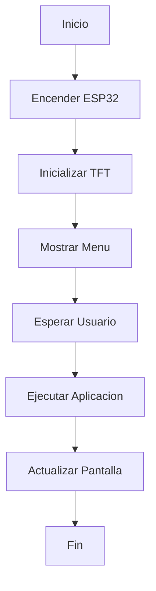

# MINI_PC

Proyecto de Mini PC desarrollado con ESP32 y pantalla TFT ILI9341.

## Componentes

- ESP32
- TFT ILI9341
- Touch Screen
- Batería
- Módulo SD

## Funciones

- Menú interactivo
- Navegación táctil
- Aplicaciones
- Interfaz gráfica

## Diagrama de Flujo

